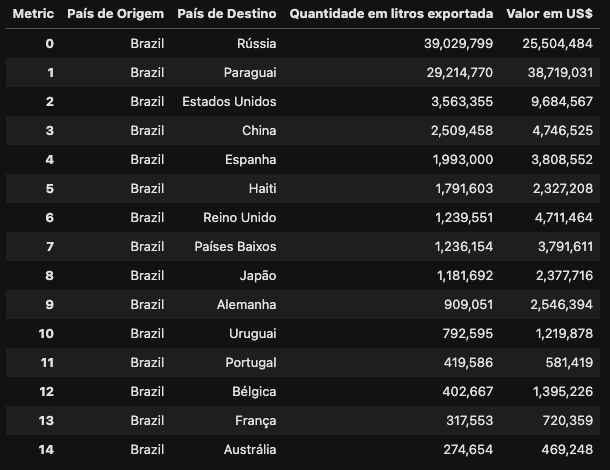

# Análise sobre a Exportação de Vinhos no Brasil

Análise sobre a Exportação de Vinhos no Brasil
FIAP: Pós Tech - Data Analytics Tech Challenge #01

### Grupo 66 - Autores:

- Flademir de Albuquerque

- Lucas Ordonio

- Francisco das Chagas Peres Júnior

- Tadeu Tupinambá
### Vídeo explicando o projeto:
https://youtu.be/kmp_RYawfSM

### Slides com informações apresentadas:
https://www.canva.com/design/DAFylduOAf8/WvsrF5Cr7cwE4IWMOG5oIQ/edit?utm_content=DAFylduOAf8&utm_campaign=designshare&utm_medium=link2&utm_source=sharebutton

### Objetivo
O objetivo é apresentar análise sobre esse desempenho de exportação brasileira, mostrando os fatores que influenciaram as maiores vendas e o que podemos fazer para performar mais.

### Arquivos:
https://github.com/Xicojr/TechChallenge1

- `./analises_externas/`
  - Outras fontes de dados que foram análisadas estão dentro desse folder
- `./Dados/`
  - Aqui se encontra os dados utilizados para a análise
- `./First_Tech_Challenge.ipynb`
  - Análise de dados, EDA e geração de gráficos
- `./Ouput_Tabela_Tech_Challenge.ipynb`
  - Geração da tabela requerida pelo trabalho
    - País de origem
    - País de Destino
    - Quantidade de litros de vinho exportados
    - Valor total das exportações em dólares

### Conclusão da Análise (EDA)

### Análise Exploratória dos Dados de Exportação de Vinho
## 1. Principais Destinos de Exportação por Valor
Os países onde é gerado o maior valor a partir das exportações de vinho são:

- Paraguai: $38,719,031

- Rússia: $25,504,484

- Estados Unidos: $9,684,567

- China: $4,746,525

- Reino Unido: $4,711,464

## 2. Menores Destinos de Exportação por Quantidade
Os países que recebem a menor quantidade de vinho (onde a quantidade > 0) são:

- Tuvalu: 2 litros

- Indonésia: 5 litros

- Belice: 9 litros

- Mauritânia: 9 litros

- Comores: 9 litros

## 3. Razão Valor-por-Quantidade
Países com o maior valor gerado por litro exportado:

- República Eslovaca: $27,46 por litro

- Bulgária: $13,20 por litro

- Bangladesh: $11,09 por litro

- Croácia: $11.04 por litro

## 4. Distribuição dos Dados
- Valor:
  - Média: $880,033

  - Mediana: $17,079

  - Desvio Padrão: $4,203,946

### Fontes de dados:
Todos as bases de dados são mantidas pelas respectivas fontes.

- https://ourworldindata.org/grapher/wine-consumption-per-person?tab=table&time=2005..2019
- http://vitibrasil.cnpuv.embrapa.br/index.php?opcao=opt_01
- https://bdmep.inmet.gov.br/
